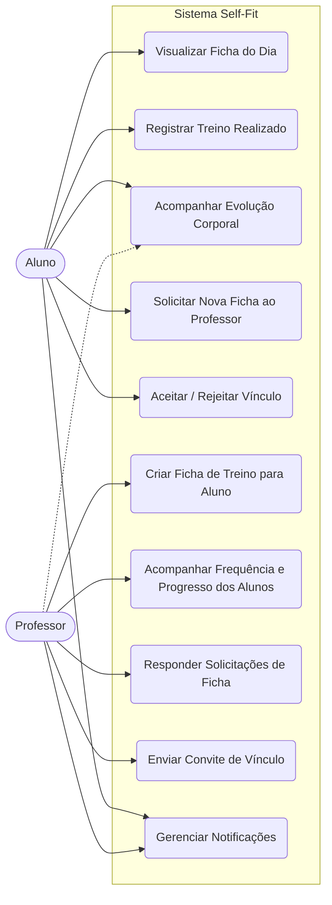
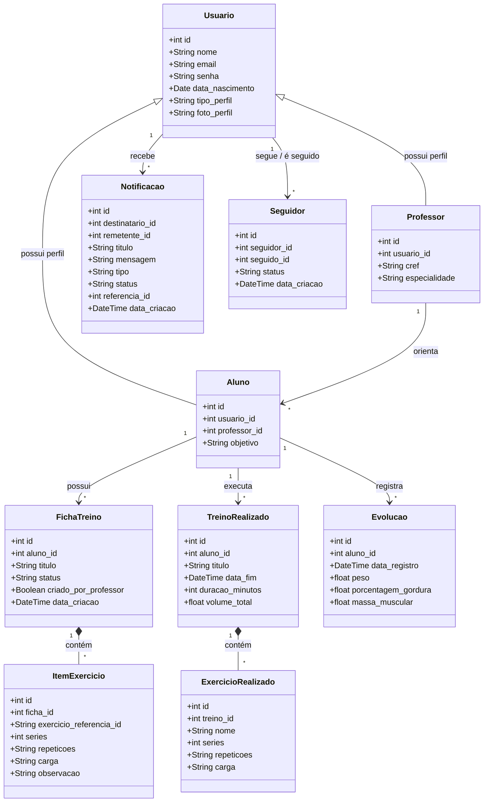

# Self-Fit 🏋️

Aplicação mobile para **Gestão de Treinos de Musculação**, centralizando a interação entre professores e alunos.

---

## 👥 Integrantes do Grupo

| Membro | Papel |
|---|---|
| **Carlos Eduardo Santos Oliveira** | Back-end — Desenvolvimento da API (FastAPI), rotas, conexão com o banco de dados e autenticação |
| **Gabrielli Valelia Sousa da Silva** | Front-end — Construção da interface (React Native / Expo), consumo da API e navegação do sistema |
| **Natalia Dias Santos Mota** | Back-end e Arquitetura — Modelagem do banco de dados (PostgreSQL), regras de negócio, cálculos de treino e documentação |
| **Pedro Alonso Araujo Silva** | Front-end e Infra — Desenvolvimento da interface, integração front/back, testes e ambiente de execução |

---

## 🎯 Objetivo do Sistema
- Desenvolver uma aplicação mobile responsiva voltada para a Gestão de Treinos de Musculação, centralizando a interação entre professores e alunos.
- No sistema, o professor será responsável por montar e alterar as fichas de exercícios e acompanhar o progresso e a frequência de seus diversos alunos.
- Já o aluno poderá visualizar suas fichas de treino prescritas, montar fichas de sua preferência (com validação do professor), registrar as cargas e repetições executadas no dia, além de monitorar sua própria evolução contínua de forma estruturada.

---

## 🛠️ Tecnologias

### Front-end
| Tecnologia | Versão |
|---|---|
| React Native | 0.81.5 |
| Expo | ~54.0.33 |
| Expo Router | ~6.0.23 |
| NativeWind (Tailwind CSS) | ^4.2.3 |
| Axios | ^1.15.0 |
| React Native Calendars | ^1.1314.0 |
| React Native Chart Kit | ^6.12.0 |
| AsyncStorage | 2.2.0 |

### Back-end
| Tecnologia | Versão |
|---|---|
| Python / FastAPI | 0.136.1 |
| SQLAlchemy | 2.0.49 |
| PostgreSQL (Neon) | — |
| Passlib + bcrypt | autenticação JWT |
| Uvicorn | 0.46.0 |

### Ferramentas de IA utilizadas no desenvolvimento
Cursor · Claude · GitHub Copilot · Gemini

---

## 📋 Histórias de Usuários

  **Visão Aluno**
  
1. Como aluno, eu quero visualizar minha ficha de treino do dia para saber exatamente quais exercícios executar.

2. Como aluno, eu quero registrar as cargas e repetições reais que executei em cada exercício para acompanhar meu histórico de força e evolução.

3. Como aluno, eu quero visualizar um painel com meu progresso (evolução de pesos e dias frequentados) para monitorar meus resultados de forma estruturada.

4. Como aluno, eu quero montar uma proposta de ficha de treino com os exercícios da minha preferência para que meu professor possa revisar e validar.


  **Visão Professor**
  
1. Como professor, eu quero criar e atribuir uma ficha de treino personalizada para um aluno específico, definindo exercícios, séries, repetições e intervalos.

2. Como professor, eu quero visualizar uma lista com todos os meus alunos e seus respectivos status de frequência para identificar quem precisa de acompanhamento.

3. Como professor, eu quero analisar o histórico de cargas e o progresso de um aluno para ajustar sua ficha de treino conforme a evolução dele.

4. Como professor, eu quero receber notificações ou visualizar uma fila de "fichas propostas por alunos" para aprovar, editar ou rejeitar as sugestões.

---

## 📐 Diagrama de Casos de Uso



---

## 🗂️ Diagrama de Classes (Modelo de Dados)



---

## 🖥️ Telas Implementadas

### Fluxo Comum
- **Apresentação** (`presentation.tsx`) — tela inicial do app
- **Bem-vindo** (`welcome.tsx`) — onboarding
- **Login** (`login.tsx`) — autenticação por e-mail e senha
- **Cadastro** (`register.tsx`) — criação de conta (aluno ou professor) com data de nascimento

### Fluxo do Aluno
- **Home** (`home.tsx`) — feed de atividades e cards de resumo
- **Perfil** (`profile.tsx`) — dados pessoais, estatísticas e foto de perfil
- **Editar Perfil** (`edit_profile.tsx`) — atualização de foto e nome
- **Rotinas e Treinos** (`routines_and_workouts.tsx`) — listagem de fichas e início de treino
- **Treino em Execução** (`workout.tsx`) — registro de séries em tempo real com timer
- **Treinos Anteriores** (`previous_workouts.tsx`) — histórico de treinos finalizados
- **Visualizar Treino** (`view_workout.tsx`) — detalhes de um treino finalizado
- **Criar Rotina** (`create_routine.tsx`) — montagem de ficha personalizada pelo aluno
- **Editar Rotina** (`edit_routine.tsx`) — edição de ficha existente
- **Escolher Exercício** (`choose_exercise.tsx`) — catálogo de exercícios filtrado por grupo muscular
- **Métricas** (`metrics.tsx`) — gráficos de evolução de volume de treino
- **Medidas** (`measures.tsx`) — registro e gráfico de evolução corporal (peso, gordura, massa)
- **Calendário** (`calendar.tsx`) — frequência de treinos no mês
- **Notificações** (`notifications.tsx`) — convites de vínculo e solicitações pendentes
- **Adicionar Amigos** (`add_friends.tsx`) — descobrir e seguir outros alunos

### Fluxo do Professor
- **Home** (`home.tsx`) — feed de atividades dos alunos vinculados
- **Perfil** (`profile.tsx`) — dados profissionais (CREF, especialidade) e estatísticas
- **Meus Alunos** (`clients.tsx`) — lista de alunos vinculados com opção de desvinculação
- **Detalhes do Aluno** (`client_details.tsx`) — histórico de treinos, métricas e medidas do aluno
- **Notificações** (`notifications.tsx`) — solicitações de ficha e convites de seguimento

---

## 🔌 Principais Endpoints da API

| Método | Rota | Descrição |
|---|---|---|
| `POST` | `/usuarios` | Cadastrar usuário (aluno ou professor) |
| `POST` | `/login` | Autenticação (retorna JWT) |
| `GET` | `/usuarios/me` | Dados do usuário logado |
| `PUT` | `/usuarios/me` | Atualizar nome e foto de perfil |
| `GET` | `/alunos/me` | Perfil do aluno (objetivo e professor vinculado) |
| `PUT` | `/alunos/me/objetivo` | Atualizar objetivo do aluno |
| `GET` | `/alunos/minhas-rotinas` | Listar fichas de treino do aluno |
| `POST` | `/fichas` | Criar ficha (aluno ou professor) |
| `PUT` | `/fichas/{id}` | Editar ficha |
| `DELETE` | `/fichas/{id}` | Excluir ficha |
| `POST` | `/alunos/finalizar-treino` | Registrar treino realizado |
| `GET` | `/alunos/historico-treinos` | Histórico de treinos do aluno |
| `POST` | `/alunos/evolucao` | Registrar medidas corporais |
| `GET` | `/alunos/meu-historico` | Histórico de evolução corporal |
| `GET` | `/notificacoes` | Listar notificações pendentes |
| `GET` | `/notificacoes/contagem` | Contagem de notificações pendentes |
| `PUT` | `/notificacoes/{id}/responder` | Aceitar ou rejeitar notificação |
| `GET` | `/professor/alunos` | Listar alunos vinculados ao professor |
| `PUT` | `/professor/vincular-aluno/{id}` | Enviar convite de vínculo ao aluno |
| `DELETE` | `/professor/desvincular-aluno/{id}` | Remover vínculo com aluno |
| `GET` | `/professor/aluno/{id}/historico` | Histórico de treinos de um aluno |
| `GET` | `/professor/aluno/{id}/medidas` | Medidas corporais de um aluno |
| `POST` | `/aluno/solicitar-ficha` | Aluno solicita nova ficha ao professor |
| `GET` | `/professor/fichas/solicitacoes` | Listar solicitações de ficha pendentes |
| `GET` | `/professores/me` | Perfil do professor logado |
| `PUT` | `/professores/me/especialidade` | Atualizar especialidade do professor |
| `GET` | `/usuarios/descobrir` | Descobrir novos usuários para seguir |
| `POST` | `/usuarios/seguir/{id}` | Enviar solicitação de seguimento |

---

## 🚀 Como Executar

### Pré-requisitos
- Python 3.10+
- Node.js 18+
- Expo Go (dispositivo físico) ou emulador Android/iOS

### Back-end

```bash
cd back-end
pip install -r requirements.txt
uvicorn main:app --reload --host 0.0.0.0 --port 8000
```

A documentação interativa da API estará disponível em `http://localhost:8000/docs`.

### Front-end

```bash
cd front-end/self-fit
npm install
npx expo start
```

Escaneie o QR Code com o app **Expo Go** ou pressione `a` para abrir no emulador Android.

---

## 📁 Estrutura do Projeto

```
projeto_eng_software/
├── back-end/
│   ├── main.py          # Todos os endpoints da API
│   ├── models.py        # Modelos do banco de dados (SQLAlchemy)
│   ├── schemas.py       # Schemas de validação (Pydantic)
│   ├── auth.py          # Autenticação JWT (python-jose + bcrypt)
│   ├── database.py      # Conexão com PostgreSQL (Neon)
│   └── requirements.txt
└── front-end/
    └── self-fit/
        ├── app/          # Telas (Expo Router - file-based routing)
        ├── components/   # Componentes reutilizáveis
        ├── constants/    # Cores e configurações globais
        ├── hooks/        # Custom hooks
        └── assets/       # Imagens e ícones
```
